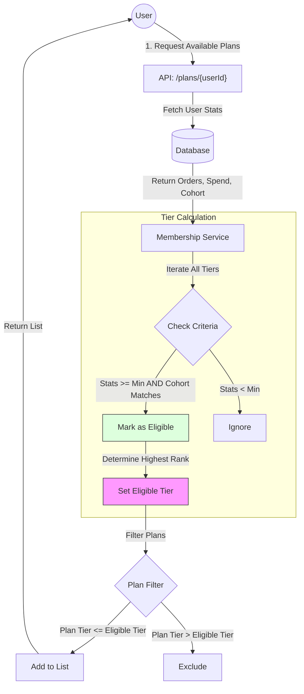
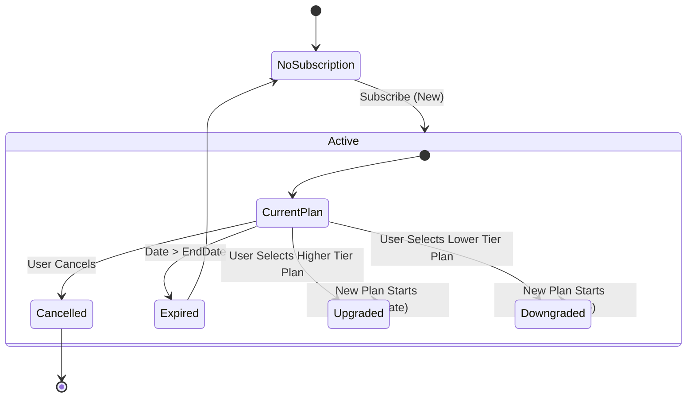
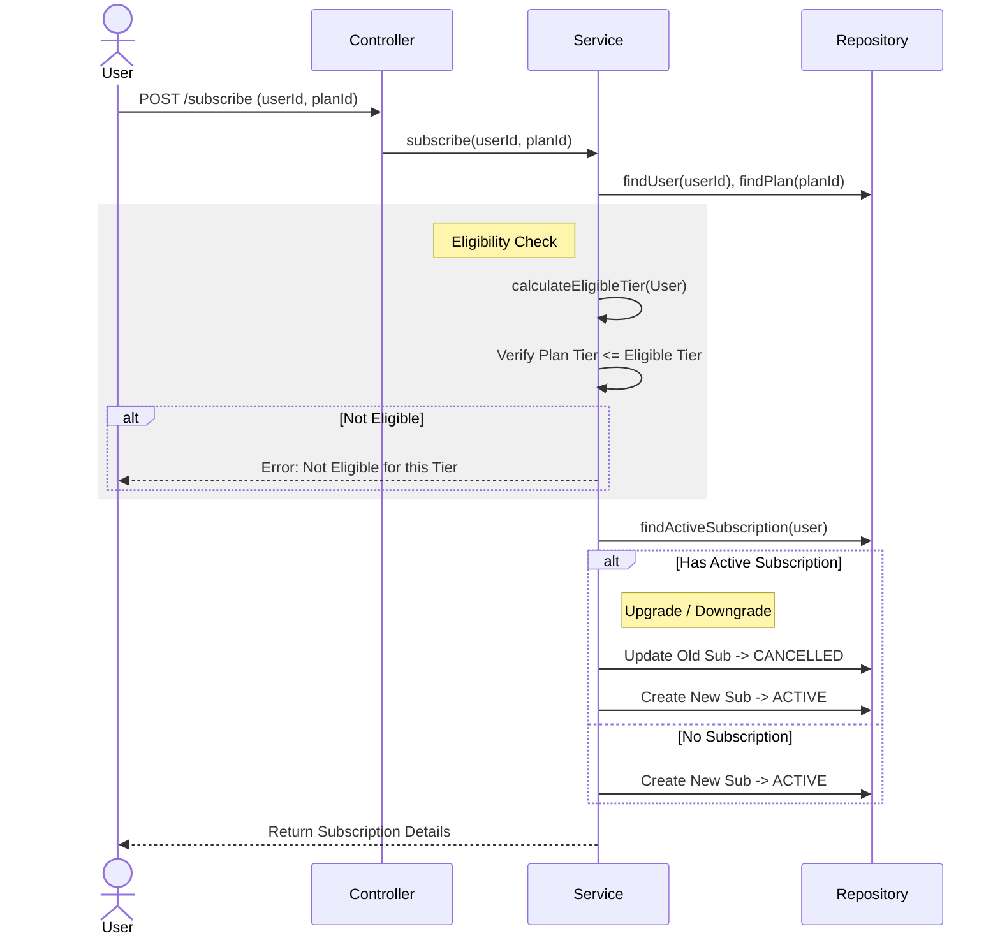

# Membership Program Logic & Flow

## 1. Tier Eligibility & Plan Selection Logic
This flow shows how a User's stats determine their eligible Tier and which Plans they can view/purchase.

## 2. Subscription Lifecycle
This state diagram shows the lifecycle of a subscription including Upgrades and Downgrades.

## 3. Detailed Subscription Flow
Sequence of events when a user subscribes.

